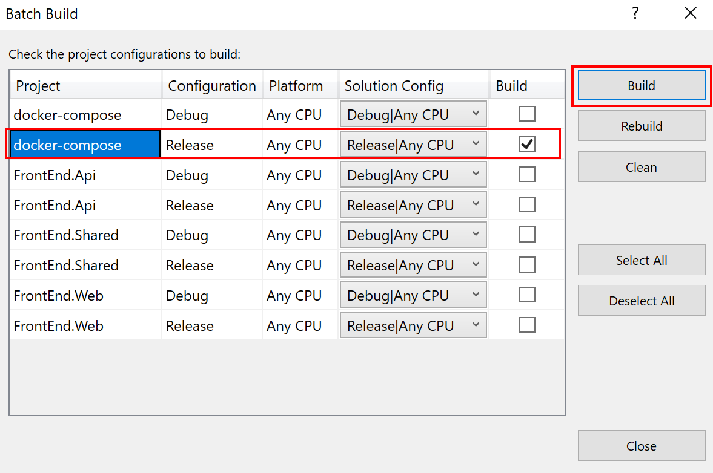

# Bringing Containers to Production

As of now the FrontEnd application is simple. A web and an api project with a clear dependency. As the application complexity increases overtime (more teams deploy web frontends, apis, cron jobs and workers) it is adviceable to rely on a container orchestration that can perform the following actions:

- Scheduling: running containers according to a expressed desired state (i.e. run 2 web and 2 api containers). Unhealthy containers restarts. More advanced scenarios include auto scale (add more replicas as long as the CPU usage is at 75%) and running cron jobs 
- Isolation: ensuring a bad behaving container cannot take all available resources by limiting resource allocation
- State management: allow mounting volumes outside the container, so that if the container must be reallocated to a different host data will not be lost
- Application Upgrade: allows updating a version of a running application without service interruption
- Networking: providing routing, DNS resolving and network connection between containers. Advanced scenarios allows the creation of a smarter networking with built-in retries, circuit breaking and dynamic routing (based on caller, request headers, etc.)

There are many Container Orchestrations out there. We will look into Kubernetes and Service Fabric in Azure.


## Kubernetes

Kubernetes is a widely used and active open source project, started by Google based on their internal system Borg. It's highly customizable, allowing the replacementof many of it's part by custom build pieces. Think as building your orchestrator using Lego pieces, where you can replace the parts of it by different piece and colors.

### Kubernetes Development Experience

Kubernetes can be executed locally (for testing purposes) with [minikube](https://kubernetes.io/docs/setup/minikube/) or [Docker CE](https://docs.docker.com/docker-for-windows/kubernetes/).
This guide was written using Docker Kubernetes support, but the same principles can be used with minikube.

Follow the steps below to deploy the FrontEnd application to the local Kubernetes:

1. From your source code build the docker images. In Visual Studio select Build, Batch Build and select "docker-compose" in Release mode. This will create the frontendweb:latest and frontendapi:latest images 


1. Tag the images, adding a version and the container registry information (fbeltrao in my case):
```cmd
docker tag frontendapi:latest fbeltrao/frontendapi:1.0 & docker tag frontendweb:latest fbeltrao/frontendweb:1.0
```
3. Publish docker image to an image registry. This guide is using Docker Hub, but it can be used with Azure Container Registry. 
```cmd
docker push fbeltrao/frontendapi:1.0 & docker push fbeltrao/frontendweb:1.0
```

4. Apply the deployment to kubernetes using the kubectl command line. To view the yaml file content [click here](https://github.com/containers-on-azure/FrontEnd/blob/version-01/deployment/k8s/local-deployment.yaml)
```cmd
kubectl apply -f https://raw.githubusercontent.com/containers-on-azure/FrontEnd/version-01/deployment/k8s/local-deployment.yaml
```

You can check that the web service is running:
```cmd
$ kubectl get services
NAME           TYPE           CLUSTER-IP       EXTERNAL-IP   PORT(S)        AGE
frontend-api   ClusterIP      10.107.213.245   <none>        80/TCP         18s
frontend-web   LoadBalancer   10.103.94.135    localhost     80:30392/TCP   18s
kubernetes     ClusterIP      10.96.0.1        <none>        443/TCP        4h
```

Open the browser where the web is bounded (in my case http://localhost:80) and check that the application is running.


To delete the application run the bash command
```bash
kubectl delete -f https://raw.githubusercontent.com/containers-on-azure/FrontEnd/version-01/deployment/k8s/local-deployment.yaml
```

### Kubernetes Deployment in Production

[Demonstrate how to deploy an AKS cluster]

[Demonstrate how to use kubectl to deploy the same application to the cluster]


## Service Fabric

Another container orchestration alternative is Service Fabric. Service Fabric, is an open source project lead by Microsoft used internally to serve many Azure services (SQL Azure, IoT Hub, Cosmos DB, etc.). While Kubernetes and Börg are different source versions, Service Fabric has a single version (same version used by Microsoft and others).

If Kubernetes is the Lego orchestrator, Service Fabric can be described as the Playmobil. It is simpler to build and start playing, but offers a limited amount of extensibility.

### Service Fabric Development Experience

Visual Studio offers a Service Fabric SDK where you can install and run local cluster on the development machine. The debug experience is great, as normal projects.

### Service Fabric Deployment in Production

Service Fabric has 2 deployment models in Azure:

- Dedicate cluster, where you provision a set of virtual machines running Service Fabric
- Serverless, where there is no need to provision a cluster. The required VMs will be created during your application deployment. This options is called Service Fabric Mesh and is currently in public preview.

This guide demonstrates how to deploy our application to Service Fabric Mesh. As of now deployment is only available using the Azure cli or Visual Studio tooling. Follow the steps below to deploy it using the cli:

1. Ensure that you have the [Azure cli installed](https://docs.microsoft.com/en-us/cli/azure/install-azure-cli?view=azure-cli-latest)
1. Login to your Azure Subscription
```cmd
az login
```
3. Create a resource group to deploy the application (you can deploy in a different location if you want)
```cmd
az group create --name sfmFrontEndApp --location westeurope
```
4. Deploy the application. The command will take a while to be finalized.
```cmd
az mesh deployment create --resource-group sfmFrontEndApp --template-file C:\dev\github.com\containers-on-azure\FrontEnd\deployment\servicefabric\mesh_deployment.json
```
5. View application running
```bash
az mesh app show --resource-group sfmFrontEndApp --name FrontEndApp
```
2. View application network
```bash
az mesh network show --resource-group sfmFrontEndApp --name FrontEndAppNetwork
```
3. View api application log
```bash
az mesh code-package-log get --resource-group sfmFrontEndApp --application-name FrontEndApp --service-name api --replica-name 0 --code-package-name api
```
3. View web application log
```bash
az mesh code-package-log get --resource-group sfmFrontEndApp --application-name FrontEndApp --service-name web --replica-name 0 --code-package-name api
```
4. Delete application
```bash
az group delete --name sfmFrontEndApp --no-wait
```

## Improving the deployment experience

As of now the FrontEnd application has been deployed to Azure manually. The team is aware that they have to build a deployment pipeline that will start once code is committed, building, testing and deploying to production.

We will cover this in next step.

[Go to Start](./ReadMe.md)\
[Go to previous step](./Step2.md)\
[Go to next step](./Step4.md)