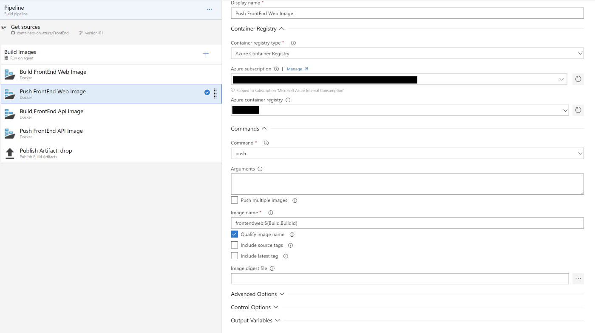

# FrontEnd automating build/deployment process

The FrontEnd team saw how Kubernetes can remove many of the difficulties in deploying applications. However, the current method requires too much manual work. They want to deploy automatically, after code is committed. This step will demonstrate how to use Visual Studio Online (aka VSTS) to automate the build and deployment pipeline.

1. With Visual Studio create new project.

## Build & Deploy

The first step is automating code commits to build and deployments. The workflow is the following:\
Code committed -> Build Project -> Build & Publish Docker Image -> Deploy to Stage

VSTS does that, even if the code is in GitHub. In VSTS we split this workflow in 2 phases build and release. Build is triggered once a code commit happens, create new docker images and tagging with the new build number. Once the image is published the release kicks-in, deploying the images to the staging environment.

### Setting up the build process

Create a new build pipeline:

1. Select the GitHub where the code is located as the source
2. Start an empty template. Add 4x "Docker" tasks
3. Set the FrontEnd Web build process. Important values are:
- Command: build
- Dockerfile: src/FrontEnd.Web/Dockerfile
- Build Context: $(Build.Repository.LocalPath)
- Image name: frontendweb:$(Build.BuildId)

4. Set the FrontEnd Web Image push process. Important values are:
- Command: push
- Image name: frontendweb:$(Build.BuildId)

5. Set the FrontEnd API build process, just replacing the Dockerfile and Image name
6. Set the FrontEnd API push process, replacing the Image name
7. Add new task of type 'Publish Build Artifacts' (in order to publish the ./deployment folder), setting following properties:
- Path to publish: $(Build.Repository.LocalPath)

Now, every time changes are commited in the GitHub repository a new build starts. The next step is automating the deployment process

### Setting up the deployment process

Automatic deployment to development/stage can be triggered once the build is finished. This process is named as Release in VSTS. Let's create it.

1. Create new Release Pipeline, selecting Empty Job as template
2. As the artifact choose the build process created previously, enabling Continuous deployment trigger

3. Create/rename the Stage to "Stage" and edit it, adding "Replace Token" task. The goal of this task is to set in the deployment yaml file the newly built images (Replace image: `#{DOCKER_REGISTRY}#/frontendapi:#{Build.BuildId}#` to the actual image to be used)

4. Lastly we deploy the application using `kubectl apply` with the transformed yaml file as input. Reference the yaml file from the drop location `$(System.DefaultWorkingDirectory)/ContainersOnAzure-version-01-build/drop/deployment/k8s/stage/stage-deployment.yaml` 

The goal is quick as possible to deploy a new version to the development environment. Unit testing will fail during the build phase. Integration tests will fail once the new version reaches the dev environment.

## Deploying to QA/Production

Doing auto deployments to QA and production requires an established devOps culture allowing canary releases, live testing, automatic rollbacks. For starters, let's implement a scenario where the QA/production environments are defined in the repository. Tag the deployment repository kicks-off the deployment. Follow the steps below to implement this scenario with VSTS:

1. Create a new build which will have the purpose of generating an artifact with the yaml definition used to deploy the application. It is important to define the build trigger once a tag v* is applied (In Triggers, set branch specification as refs/tags/v*).

2. Create a new release triggered by the build created previously created. It has a single task of type "Deploy to Kubernetes". As arguments define the `-f 
-f $(System.DefaultWorkingDirectory)/containers-on-azure-vtag-build/drop/frontend/version01/`.
Tag deployment as v* -> Publish deployment scripts

[Go to Start](./ReadMe.md)\
[Go to previous step](./Step3.md)\
[Go to next step](./Step5.md)